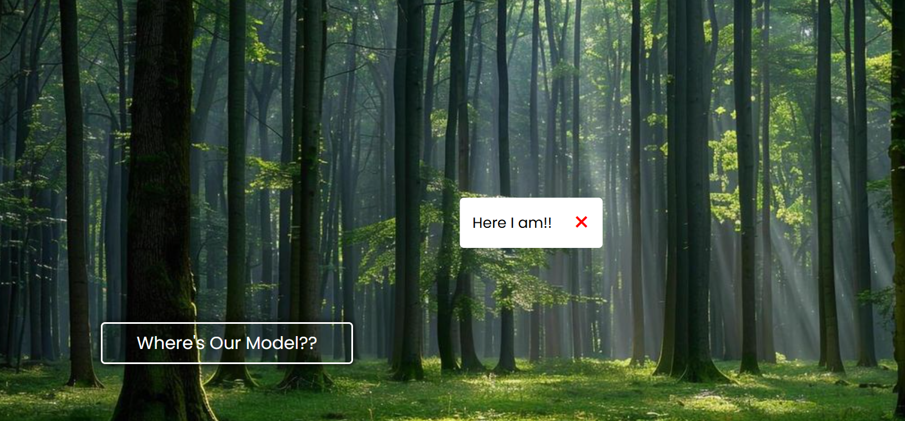

Modal Popup Project
📌 Description

This is a simple Modal Popup project built using HTML, CSS, and JavaScript.
When the user clicks on the modal trigger text, the modal smoothly animates from the top and appears at the specified position on the screen. The modal can be closed by clicking the close (×) button or by clicking anywhere outside the modal window.

This project focuses on understanding DOM manipulation, event handling, and CSS animations.

🚀 Features

Smooth top-to-center modal animation

Click to open modal

Click outside modal to close

Close modal using the × button

Lightweight and beginner-friendly

🛠️ Technologies Used

HTML – Structure

CSS – Styling & animations

JavaScript – Interactivity & event handling

📂 Project Structure
modal-project/
│
├── index.html
├── styles.css
└── script.js
|\_\_ Images

▶️ How It Works

Click on the modal trigger text/button.

The modal animates from the top and appears on the screen.

Click the × button or anywhere outside the modal to close it.

🎯 Purpose of the Project

Practice JavaScript DOM manipulation

Understand event bubbling and click handling

Learn basic UI animations using CSS

(Optional: Add a screenshot or GIF of your modal here)

📄 License

This project is open-source and free to use for learning purposes.
